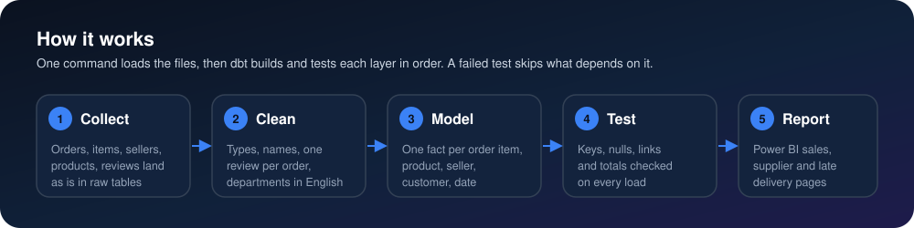
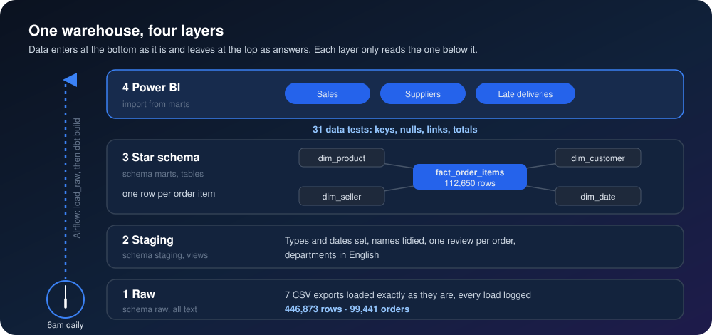
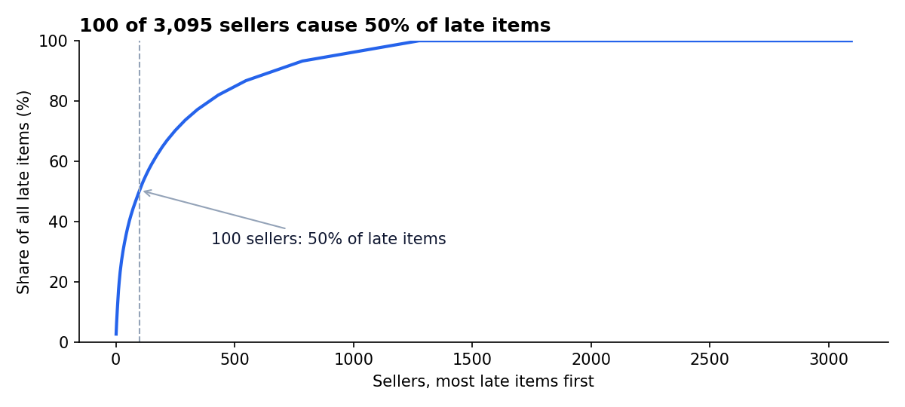
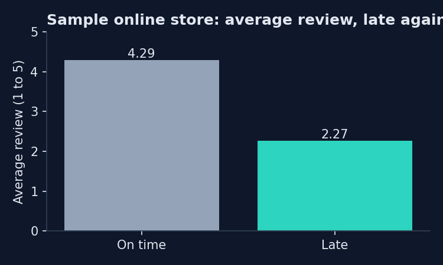
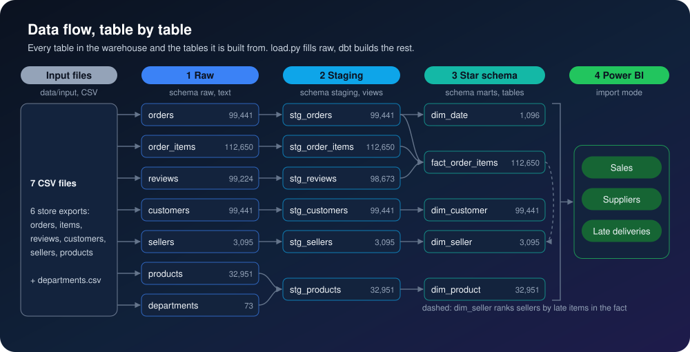
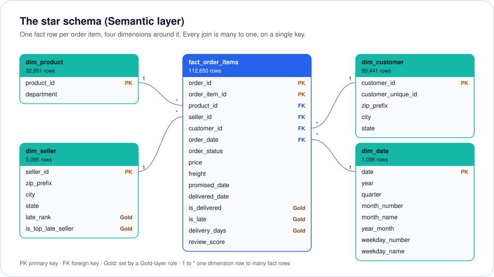
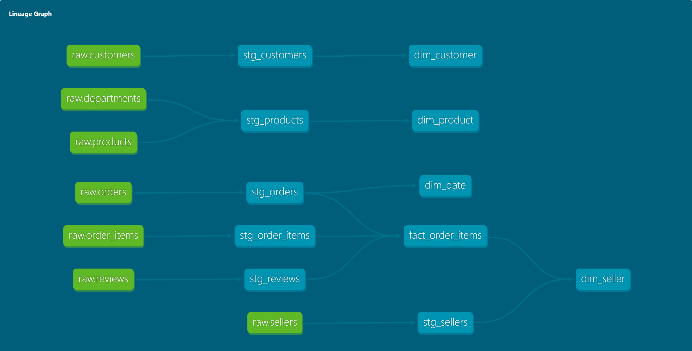

<p align="center">
  
</p>

<p align="center">
  
</p>

<p align="center">
  
  
  
  
  
</p>

> 📖 **New to data?** [The project explained, from zero](docs/explained.md): every word, every number and the interview questions, in plain words.

<h3 align="center">99,441 orders in one star schema:<br>100 of 3,095 sellers account for half of all late-delivered items.</h3>

## The problem

An online store sells products from thousands of sellers, its suppliers. Orders, items, sellers, products and reviews come out as separate exports. Every report starts with a day of cleaning, every team gets a different total, and nobody can say which suppliers make customers wait.

## 🛠️ The solution

A warehouse built in one run. The input files are checked and load as they are, SQL cleans them, a star schema answers the questions, and a Power BI report reads the result.



The mental model is four layers. Each one only reads the layer below it, so a mistake can be traced down to the file it came from.



## 📈 The result

<p align="center">
  
</p>

- **99,441 orders** (112,650 order items) load into one star schema in one run.
- **6.8% of delivered orders arrive late** (6,534 of 96,470).
- **100 of the 3,095 sellers account for 50.4% of late-delivered items**, while shipping 41.6% of all delivered items. Their late rate is 8.0%, against 5.6% for every other seller: a short list for the supplier team to call first.
- **Late orders lose two stars:** they average 2.27 out of 5, against 4.29 for orders on time.





Every number above is computed in [`analysis/analysis.ipynb`](analysis/analysis.ipynb), which runs top to bottom against the warehouse and saves its outputs. How each one is measured:

| Number | Measured as |
|---|---|
| Orders loaded | Rows in `raw.orders` after the load (`raw.load_log` keeps the count of every load) |
| Late | Order delivered (status `delivered` with a delivery date) on a later day than the date promised to the customer |
| Seller share of late items | Late items of the 100 sellers with the most late items (`dim_seller.is_top_late_seller`, ties broken by seller id), over all late items. Counted per item, because one order can hold items from several sellers |
| Average review | Each reviewed order counted once; when an order was reviewed twice, the latest review |

## 📊 Power BI report

Three pages: **Sales**, **Suppliers** and **Late deliveries**. The [`powerbi/`](powerbi/) folder builds it from nothing, step by step, and lists the numbers each page must show.

*Screenshots are added here once the report is built.*

## ▶️ How to run it

<p align="center">
  
</p>

You need Docker Desktop, and Python 3.10+ for the notebook.

1. Get the data (see [Data](#data)) and unzip the six CSV files into `data/input/` (the committed `departments.csv` is already there; [input guide](data/input/README.md)).
2. Start the warehouse (Postgres on port 5441, user and password `warehouse`):
   ```bash
   docker compose up -d
   ```
3. Install the Python tools:
   ```bash
   pip install -r requirements.txt pandas matplotlib jupyter
   ```
4. Load the files, then build the star schema:
   ```bash
   python load.py
   cd dbt && dbt run && cd ..
   ```
5. Run the notebook:
   ```bash
   jupyter nbconvert --to notebook --execute --inplace analysis/analysis.ipynb
   ```
6. Build the report with [`powerbi/README.md`](powerbi/README.md).

## 🏗️ For engineers

Every table, the tables it is built from, and its row count after one run:



The star schema Power BI imports:



The same lineage as dbt draws it (`dbt docs generate`, then `dbt docs serve`):



| Decision | Why |
|---|---|
| Load the required columns as text, clean in SQL (ELT) | The raw layer holds the input values unchanged, so any number can be traced back and the cleaning can change without reloading |
| Full reload in one transaction, no scheduler | The source is a fixed export that never changes, so there is nothing to refresh on a timer. Running it again gives the same result |
| One fact at order-item grain | Sales, freight and seller live on the item. Order-level facts (status, dates, lateness, review) repeat on each item, so measures count orders and reviews once with a distinct count |
| Department as a column of `dim_product` | A star, not a snowflake: one join fewer for every Power BI visual |
| No history (SCD type 2) on sellers yet | The export holds each seller once, with no changes to track. With a live seller feed, a dbt snapshot would add it |

```
load.py                  checks the input files, then loads them into the raw schema, logged in raw.load_log
dbt/models/staging/      6 views: types, names, one review per order, departments in English
dbt/models/marts/        the star schema: fact_order_items and four dimensions
dbt/dbt_project.yml      the two rules: late after 0 days, top 100 sellers
analysis/analysis.ipynb  every number in this README
powerbi/                 the report, step by step
```

Stack: PostgreSQL 17, Python, dbt Core, Docker Compose, Power BI Desktop.

## 🗂️ Data

The [Brazilian E-Commerce Public Dataset by Olist](https://www.kaggle.com/datasets/olistbr/brazilian-ecommerce) on Kaggle (CC BY-NC-SA 4.0): about 100,000 orders placed from 2016 to 2018. Its sellers stand in for the store's suppliers and its product categories for departments. Amounts are in Brazilian reais. The files are not in this repo (the licence is non-commercial); download them from Kaggle into `data/input/`. `data/input/departments.csv`, the category-to-department mapping, is committed: it is derived from the dataset's category translation file (CC BY-NC-SA 4.0, same Kaggle link).

<p align="center">
  
</p>
